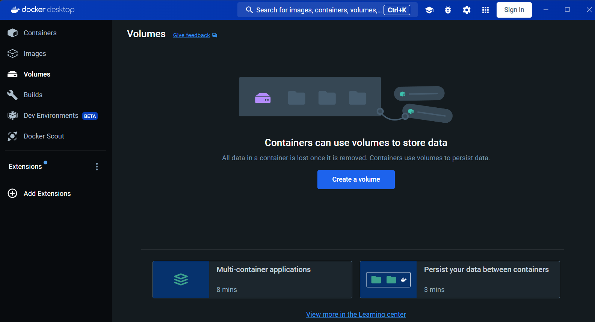
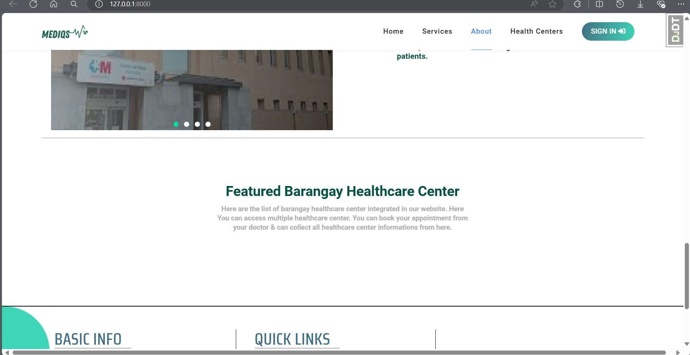
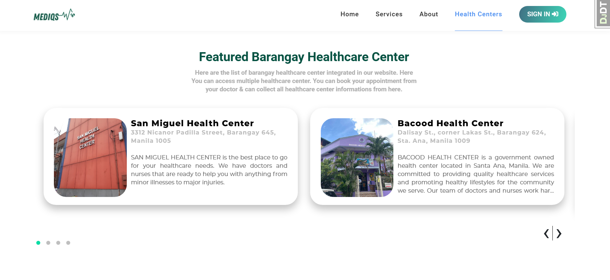
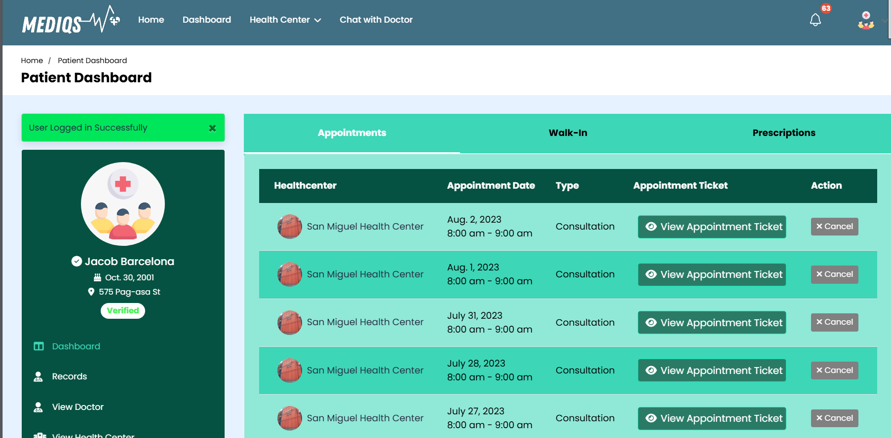

# Mediqs - REVOLUTIONIZING HEALTHCARE MANAGEMENT IN PRIMARY HEALTHCARE FACILITIES THROUGH A WEB-BASED ELECTRONIC MEDICAL RECORD PORTAL SYSTEM WITH PREDICTIVE ANALYTICS

Health Centers Portal for primary health care centers with predictive analytics for disease outbreaks

The objective of this project is to improve the overall quality of healthcare services in different healthcare centers by creating an innovative web-based electronic medical record (EMR) system with the use of Django, Javascript, Bootstrap, Jupyter Notebook, and Postgresql. The overall goal is to create a seamless, comprehensive healthcare system that improves the accessibility, efficiency, and accuracy of patient information, streamlines healthcare workflows, and enhances patient outcomes.

# Requirements

| Install                                          | Download links                                                           |
| ------------------------------------------------ | ------------------------------------------------------------------------ |
| Python 3.10 or below                             | [Click here to downlod python](https://www.python.org/downloads/)           |
| Visual Studio Code                               | [Click here to download visual studio code](https://code.visualstudio.com/) |
| Download Extension in Visual Studio Code: Python |                                                                          |

# Setup

1. Run command prompt and change directory to project folder.

   - mas best if yung clone mo ng repo nasa Desktop para i execute mo lang to sa command prompt
     cd Desktop
     cd Mediqs
2. Install virtual environment

```cmd
pip install virtualenv
```

3. Create virtual environment

```cmd
virtualenv env
or
python -m venv env
```

4. Activate virtual environment

if using bash:

```bash
$ source ./env/Scripts/Activate
```

if using cmd

```cmd
env
```

or

```cmd
env\scripts\activate //what im using
```

5. Install dependencies

```cmd
pip install -r requirements.txt
```

6. Make migrations

```cmd
python manage.py makemigrations
```

8. Migrate

```cmd
python manage.py migrate
```

9. Collect static files. After running command wait for a while then type **yes**

```cmd
py manage.py collectstatic
```

10. Run server

```cmd
run
```

if not working

```cmd
./run
```

or

```cmd
python manage.py runserver
```

11. Server address = 127.0.0.1:8000
    for admin
    127.0.0.1:8000/admin

If you installed Vistual Studio Code and virtual environment

1. Open Project Folder
   Go to File -> Open Folder -> Mediqs then Open
2. Go to View -> Command Palette (or Crtl + Shift + P)-> Type Python Interpreter -> Select it -> Select the Recommended (Mine is Python 3.11.2('env': venv) \env\Scripts\python.exe)
3. Now you can use the terminal of Visual Studio Code and instantly executes going to virtual environment
4. Just enter ./run to run the server

If you have any changes to models.py/admin.py make sure to

1. Go to terminal with env on
2. type python manage.py makemigrations
3. If no error type, python manage.py migrate

# Populate the database using Postgresql (Optional)

If you haven't already, you will need to have psql installed. psql is going to be the command line interface that we will be using to interface with our Postgres database. This includes pg_dump and pg_restore the two commands we will be using.

1. **How to Install PSQL CLI**
   **MacOS**: Those on MacOS can use Homebrew to install Postgres, this includes the psql client.

```cmd
brew update
brew install postgresql
```

   **Ubuntu**: You can install the Postgres client separately without having to install the full server.

```cmd
sudo apt-get update
sudo apt-get install postgresql-client
```

    **Windows**: We recommend using WSL2 or you can install the Postgres tools with the [Windows installer.](https://www.postgresql.org/download/windows/)

2. The PG Restore Command
   **pg_restore** connects to a PostgreSQL database and restores a backup made from pg_dump. The command is structured in the following way:

```cmd
pg_restore -U <username> -h <host> -p <port> -W -F t -d <db_name> <dump_file_name>
```

    After you gather your variables for the database instance you want to restore to, your command should look like the 		following:

```cmd
pg_restore -U postgres -h containers-us-west-15.railway.app -p 6473 -W -F t -d railway mediqsbackup
```

**Note: the dump_file_name is mediqsbackup located in the main folder of mediqs**

# Using Docker Desktop for Postgresql Setup

1. Install Docker Desktop

   [Install Docker Desktop on Windows | Docker Docs](https://docs.docker.com/desktop/install/windows-install/)
2. After Installation

   

   Proceed to terminal and type

   ```
   docker-compose up -d
   ```
   3. Migrate using

      ```
      python manage.py migrate
      ```
   4. Check by running the server and there would be no data yet

      
   5. Get the container id and put the mediqsbackup file inside the tmp folder in docker.

      ```
      docker cp mediqsbackup (container id):/tmp/
      ```
   6. Then run

      ```
      docker exec -it (container id) pg_restore -U user --no-owner --clean -d db /tmp/mediqsbackup  
      ```
   7. Done, check it with run server again

      

      
